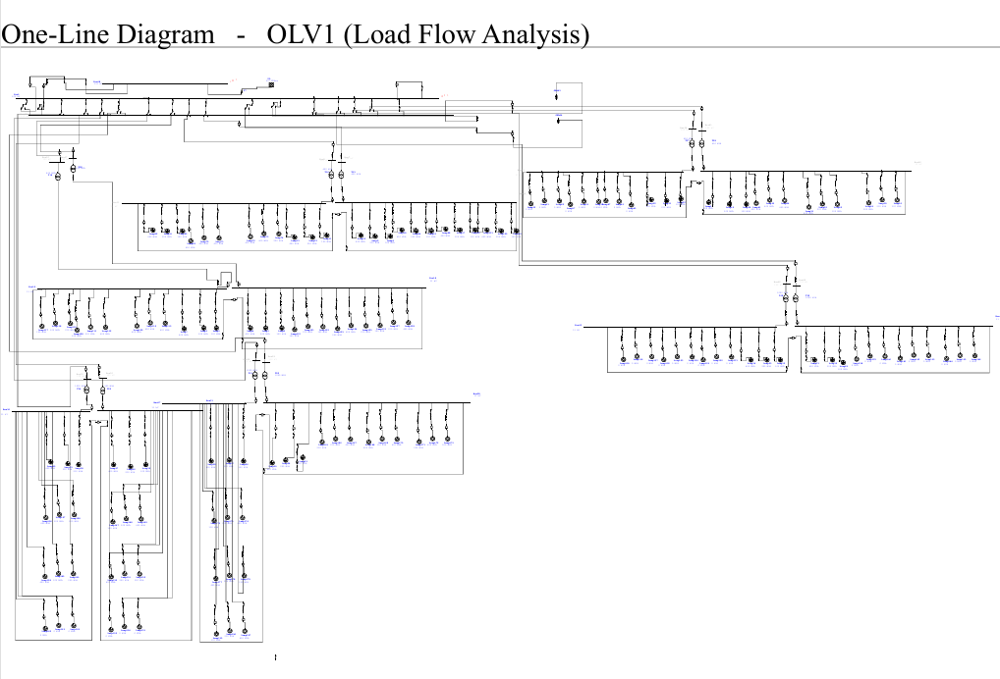
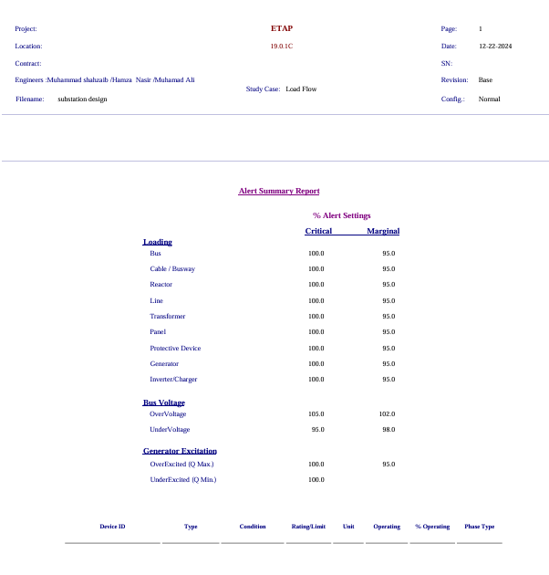
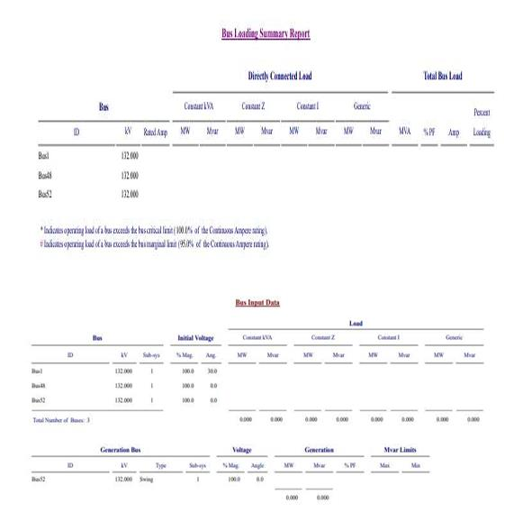
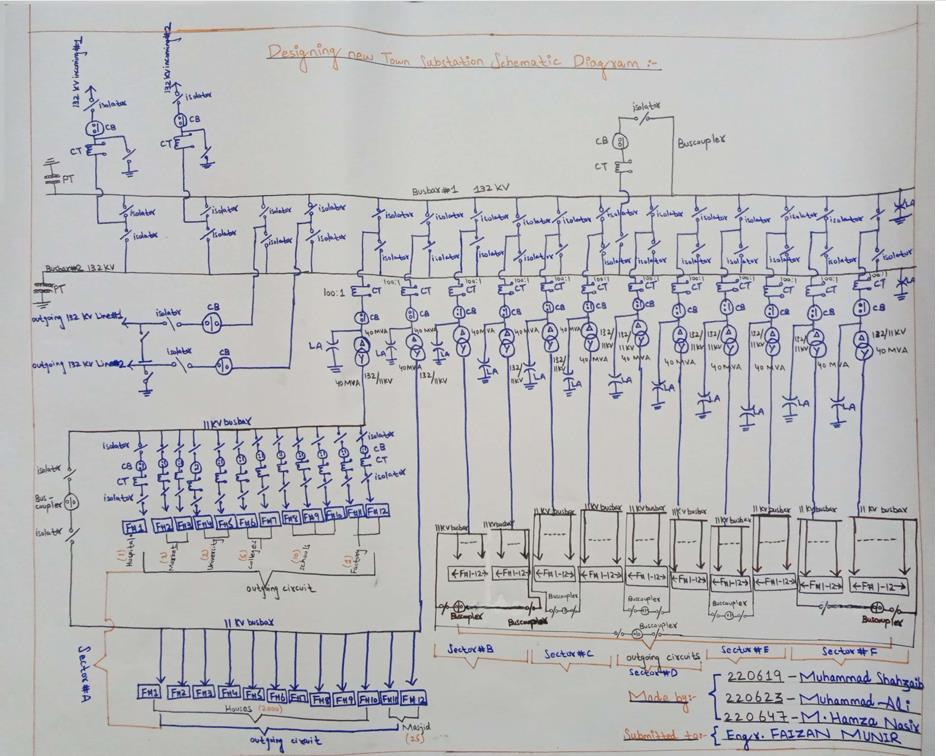

# Design and Implementation of a Power Distribution System for a New Town

**Software / Language:** ETAP 19.0.1C (no programming language used)
**Study case:** Load Flow (LF)
**Type:** Academic group project, B.E. Electrical Engineering (Power), Air University, Islamabad

## Overview

A complete power distribution system design for a newly planned town along the Lahore–Islamabad Motorway, spanning 220 km² and serving approximately 10,000 families along with hospitals, schools, universities, markets, factories, mosques, and other public facilities. Located 16 km from the nearest 500 kV national grid connection, the project covers site load breakdown, substation design, distribution network design, protection schemes, power factor correction, and ETAP simulation of the full system.

## System summary

| Item | Data |
|---|---|
| Town area | 220 km², divided into 6 sectors (A–F) |
| Residential load | Sectors A–D: 2,000 houses each; Sectors E–F: 1,000 houses each |
| Public facilities | Hospitals, mosques, markets, schools, colleges, universities, factories, theme parks, water treatment plants |
| Grid connection | 16 km from the nearest 500 kV national grid |
| Substation incoming lines | Two incoming 132 kV lines (stepped down to 11 kV) |
| Substation outgoing lines | Two outgoing 132 kV lines + 12 outgoing 11 kV lines (12 feeders each) |
| Transformer rating | Step-down transformers, ~31.5–40 MW per sector |
| Total power demand | Sectors A–D: 3,725 kW each; Sectors E–F: 4,750 kW each |
| Power factor correction | 0.7 lagging → 0.9 lagging via capacitor bank sizing |
| Max feeder length | 22 km (voltage drop kept within 5%) |

## Report content

### 1. Load breakdown and site overview
Six-sector load distribution covering residential, healthcare, religious, commercial, industrial, and educational facilities, used to size the substation and distribution network.

### 2. Substation design
Two incoming 132 kV lines from the national grid, stepped down to 11 kV, with 12 outgoing 11 kV lines (12 feeders each) distributing power across all six sectors. Includes busbar configuration, switchgear, circuit breakers, and SCADA-based monitoring.

### 3. Distribution system design
Feeder layout and conductor sizing based on current density and voltage drop, with voltage sag calculations ensuring drop stays within 5% along the longest (22 km) feeder.

### 4. Protection scheme
Differential, overcurrent, and busbar protection at the substation; overcurrent, earth fault protection, fuse coordination, and automatic reclosers on each distribution feeder.

### 5. Power factor improvement
Capacitor bank sizing to raise the power factor from 0.7 lagging to 0.9 lagging, reducing reactive power and system losses.

### 6. ETAP simulation and testing
Full one-line diagram modeled in ETAP with load flow analysis, alert summary, and bus loading summary reports, plus protection scheme testing under bus-to-bus and line-to-line fault scenarios.

### 7. Schematic diagram
Hand-drawn full substation schematic showing the 132 kV busbars, incoming/outgoing lines, transformers, 11 kV feeders, and sector-wise distribution (Sectors A–F).

## Full report

The complete report is available as a PDF: [Mega_Town_Electrical_Network_Design.pdf](Mega_Town_Electrical_Network_Design.pdf)

## My role

Contributed to the substation design, load flow simulation in ETAP, and development of the protection scheme — including sizing the step-down transformers, verifying bus loading and alert summary reports, and testing fault scenarios for system reliability.

## Team

Muhammad Shahzaib, Muhammad Ali, Muhammad Hamza Nasir, Haya Ali (Air University, Islamabad)

## Tools

ETAP 19.0.1C
